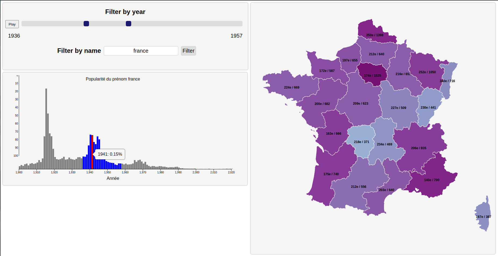

# BirthNameViz

This is the repository to our project of IGR204. The goal is to create interactable visualizations around the names of french babies between 1900 and 2019.

## Links for json maps

https://github.com/gregoiredavid/france-geojson

Maps are to be simplified with https://mapshaper.org/Visvalingam2014/ and not the original mapshaper

## Strength and Weaknesses of our Visualizations
Par Mickaël Adriao, Manon Heffernan, Adrien Coutelle, Daniel Zhou et Barthélemy Paléologue

A - 
The slider allows to define a single date or a range of dates for the visualization, the slider mode being decided by a switch. The upside is that it gives the user more control on what they want to see : the distribution for a given year or on a bigger period. 
Another option would be to have two separate inputs, instead of a mutualised slider : the user would have chosen between time or range and then specified the value. We think the mutualised slider is better in terms of redundancy and can be easily controlled.

B -
The map of France will allow the user to see any regional effects on the data. Such effects can be set whether at the regional scale, or the departmental scale. A filter can be applied to the map to separate either in departments or regions.
Visualization 1 & 2: the evolution over time can be seen thanks to the slider that changes the content of the map. The map allows the user to see the spatial distribution of names. If no specific name has been specified, then the map shows on each department the most popular name. If the user clicks on the department or region, then it is scaled up and inside it is shown a word cloud with the most popular names. If a name is specified, then a heatmap is used on the map to encode popularity.

C -
For visualization 1 : this bar graph shows the most popular names for the selected period. The bar is separated in two colours to represent the percentage of girls and boys having said name.
For visualization 3: select one of the genders, or none. This will filter the data on all visualizations.

D -
The diagram with horizontal bars shows which names are the most popular with their respective percentage given the time frame chosen from the slider A
Viz 1: allows the user to visualize which names are popular given the time frame, or more generally given the possibility to change the frame at will
Viz 3: Sheds light on the gender distribution as well, given a different encoding for male and female (color for instance)

E -
Useful for the 3 simulations : Filter the data by selecting a name, or several names. The limitation might be when we select a hundred names: not very readable.

F -
Visualization 1: This graph shows the evolution of the popularity of selected names across time. 
Visualization 3: If the gender view is selected, we will show the percentage of men vs female for the selected names. 
The main downside is when comparing very popular and very unpopular names : the scale will make it very hard to see the variation of the most unpopular. 

G -
Visualization 1: This graph shows the most popular and most unpopular names for short periods of time. It allows to see trends for the most extreme cases. The drawback is the fixed bins that may not allow the user to browse in the exact time range he wants.

